# Le Collectionist Hiring | Data Engineer |  Home Assignment
This repository contains the files needed to do the part 2 (Code writing) of the Data Engineer Home assignment.

## Prerequisites
- Have [Docker](https://www.docker.com/get-started/) installed

## Architecture schema
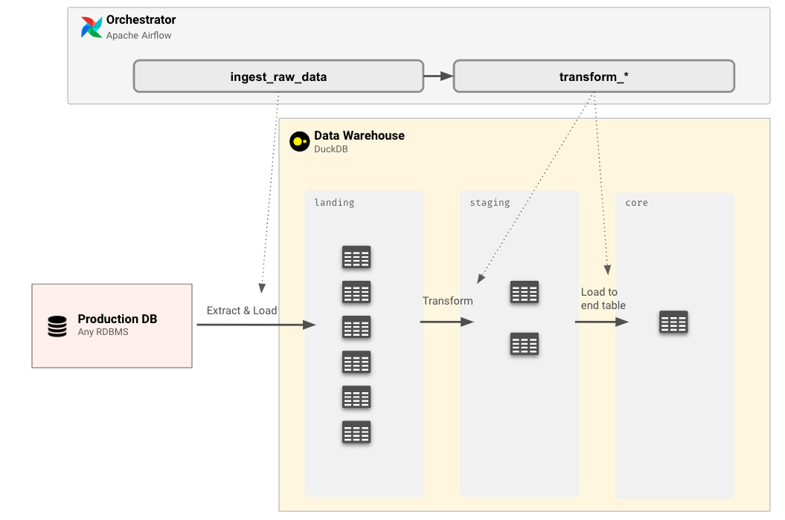

## What's important in this repository
- `dags/` folder: contains Airflow DAG files and SQL scripts you will have to use in this test
- `db/datawarehouse.db` file: DuckDB database with raw data that you will use in the test

## The Data Warehouse: DuckDB
For this home assignment, you will have at your disposal a DuckDB databse in `db/datawarehouse.db`.
It will take the role of the Data Warehouse.

### Connect to the Data Warehouse
To simplify the navigation in this database, you can download and install the SQL IDE [DBeaver](https://dbeaver.io/)
1. Open DBeaver and create a new connection. Either click on the “New Database Connection” button or go to Database > New Database Connection in the menu bar.

    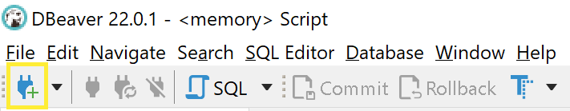
    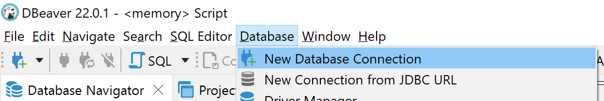

2. Search for DuckDB, select it, and click Next.
    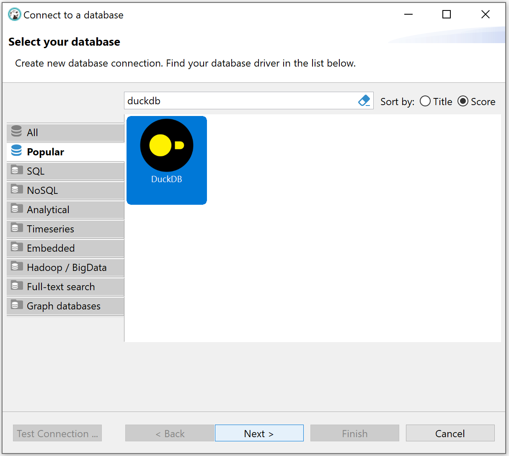

3. Browse to the DuckDB database file `db/datawarehouse.db`
4. Click “Test Connection”. This will then prompt you to install the DuckDB JDBC driver.
5. You should now see a database connection to your DuckDB database in the left hand “Database Navigator” pane. Expand it to see the tables and views in your database. Right click on that connection and create a new SQL script.

    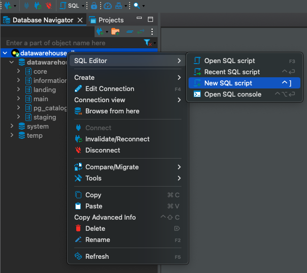

6. Explore the tables.

    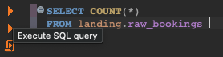


## The orchestrator: Apache Airflow
For this home assignment, you have a Apache Airflow 2.8 at you disposal to build a small data pipeline.
You have some base DAG files to help your start the home assignement.

**Note:** **you don't need to be an expert of Airflow to do this assignment**, the example provided should be enough for you to understand what to do (this allow us to evaluate how easily you can start working from existing code with explanations). The coding part will mainly consist of code completion, copy/paste and SQL queries writing.

### To run Apache Airflow
1. Open your favorite Terminal
2. Navigate to the directory containing the codebase
3. At the root of the directory, execute command
```
docker compose up
```
4. Once the webserver is running, you can access Airflow interface with this URL: http://localhost:8080/
5. Enter login and password
    - login: `airflow`
    - password: `airflow`
6. You should see this:
    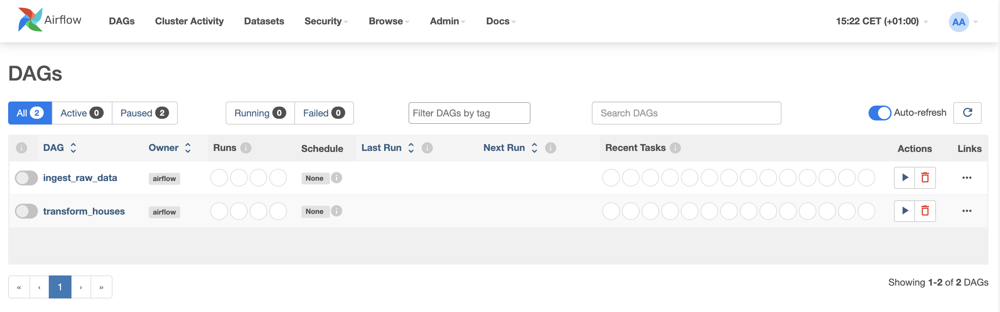


### Run DAGs
Please run the DAGs `ingest_raw_data` to simulate the extraction of data from source system to your database. This is necessary because `transform_houses` DAG is dependent of the successful end of this DAG.

#### Run `ingest_raw_data`
Method 1: On the home page
Click on the ▶️ in the Actions column for `ingest_raw_data`

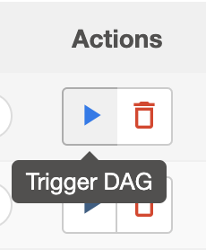

Method 2: On the DAG page
1. Click on `ingest_raw_data`
2. On this new page, find the ▶️ button on the top right side
    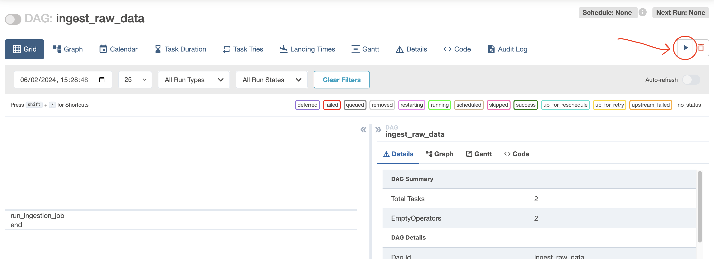

### Rerun tasks
Once you run a DAG you can rerun single task by clearing their state.
On the DAG page:
1. Click on a task
    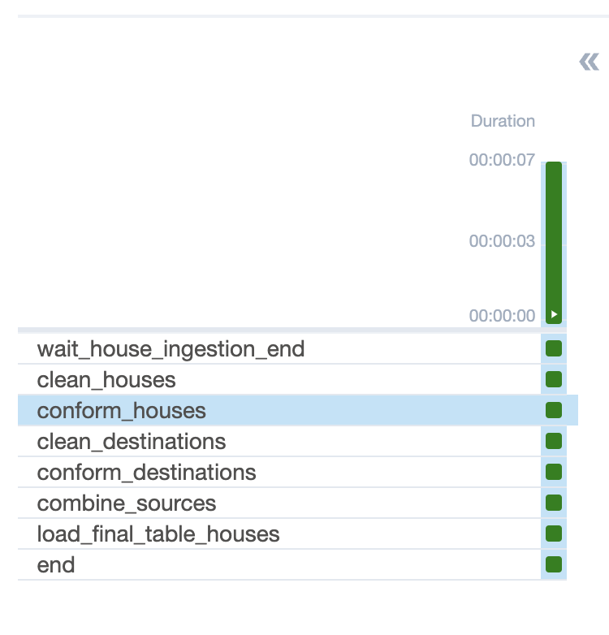
2. On the right side, find the **Clear task** button and click on it
3. Make sure that **Downstream** is selected and click on **Clear**
    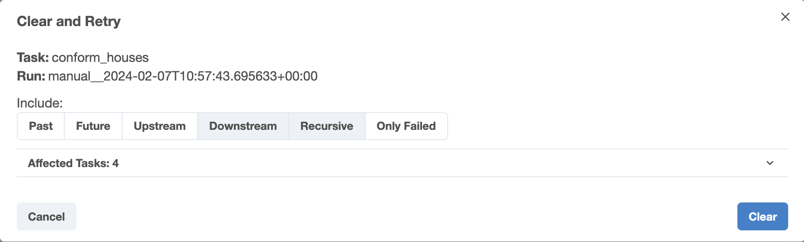
4. The DAG should rerun from that point

It is useful if you want to rerun a failed task during your development.


### Shut down Apache Airflow
Once you're done, you can shut down Airflow.

On the terminal page where you ran the Docker command, press Ctrl+C.

### References
Here are some explanations of functions used in the example DAGs.

#### The function `run_tranformation()`
This function is here to simplify the execution of a SQL query on the DuckDB database.
You just have to specify:
- `task_id`: the name of the task that will appear in Airflow
- `query`: the SQL query to execute or the path to the SQL script file in the `dags/sql/` folder
- `output_table_id`: the name of the table that will store the result so it can be used in further transformations. The table is stored in the schema `staging`.

#### The function `load_to_final_table()`
This function is here to simplify the creation of the final table at the end of the data processing steps.
You just have to specify:
- `task_id`: the name of the task that will appear in Airflow
- `input_table_id`: the name of the last transformation tables in the `staging` schema that store your final result
- `output_table_id`: the name of the final table. The result is stored in the `core` schema.

You can use those 2 functions to create other DAGs with the same model as `transform_houses`. (Feel free to copy/paste as much code as you want)


### Troubleshooting
#### New tables created by Airflow are not visible in DuckDB through DBeaver
Don't hesitate to Invalidate/Reconnect the database on DBeaver.
1. Right click on the database name
2. Click on **Invalidate/Reconnect**

    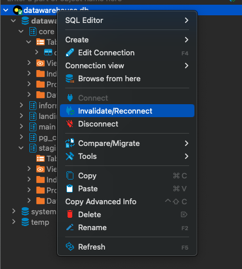

After that you can refresh the schema and should see your tables.

## Questions
If you have any question on the assignement, don't hesitate to send an email the Talent Recruiter in contact with you.
